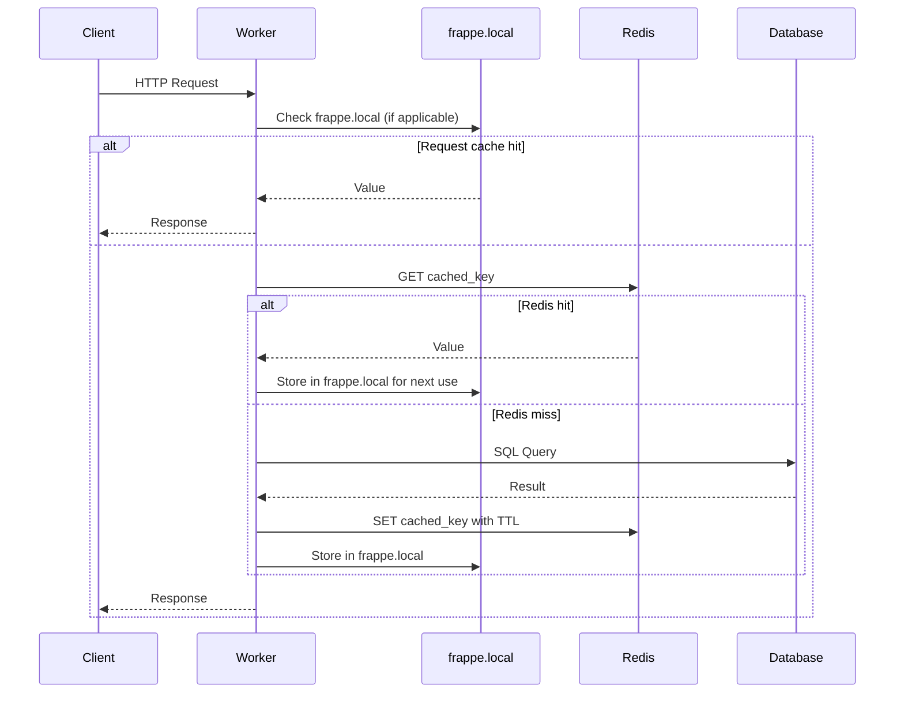

# Frappe Caching: An Ultimate User Guide

Caching is a performance optimization technique that stores copies of frequently accessed data in a high‑speed storage layer (such as memory), so that future requests for that data can be served faster than fetching it from the original, slower source (e.g., a database, an external API, or a complex computation).


---

## Table of Contents

1. [Introduction](#1-introduction)
2. [Technologies Used for Caching](#2-technologies-used-for-caching)
   - [Redis](#redis)
   - [In‑Memory Python Dictionary](#in‑memory-python-dictionary)
   - [Browser Storage](#browser-storage)
3. [Caching Architecture](#3-caching-architecture)
   - [Multi‑Layered Model](#multi-layered-model)
   - [Architecture Diagram](#architecture-diagram)
4. [Caching Process](#4-caching-process)
   - [The Cache‑Aside Pattern](#the-cache-aside-pattern)
   - [Frappe Caching Functions](#frappe-caching-functions)
   - [Process Diagram](#process-diagram)
5. [Caching Configuration for Performance](#5-caching-configuration-for-performance)
   - [Redis Connection Settings](#redis-connection-settings)
   - [Redis Server Tuning](#redis-server-tuning)
   - [Site‑level Cache Settings](#site-level-cache-settings)
6. [Required System Configuration for Better Performance](#6-required-system-configuration-for-better-performance)
7. [What Type of Data and Documents Can Be Cached?](#7-what-type-of-data-and-documents-can-be-cached)
8. [Server‑Side Caching](#8-server-side-caching)
   - [Global Redis Cache (`frappe.cache()`)](#global-redis-cache-frappecache)
   - [Convenience Methods: `get_value` and Hashes](#convenience-methods-get_value-and-hashes)
   - [Document Caching Helpers](#document-caching-helpers)
   - [Request‑Level Cache (`frappe.local`) – Deep Dive](#request-level-cache-frappelocal--deep-dive)
   - [Process‑Level Site Cache (`frappe.local.site_cache`)](#process-level-site-cache-frappelocalsite_cache)
   - [Advanced: Local Dictionary + Redis Pub/Sub](#advanced-local-dictionary--redis-pubsub)
9. [Client‑Side Caching](#9-client-side-caching)
   - [Using `frappe.call` with the `cache` Parameter](#using-frappecall-with-the-cache-parameter)
   - [Manual Browser Storage](#manual-browser-storage)
   - [Practical Examples](#practical-examples)
10. [How and When to Use Client‑Side Caching, Server‑Side Caching, and Both](#10-how-and-when-to-use-client-side-caching-server-side-caching-and-both)
    - [Decision Framework](#decision-framework)
    - [Practical Scenarios](#practical-scenarios)
11. [How Long Cached Data Persists in Memory?](#11-how-long-cached-data-persists-in-memory)
12. [How to Optimize Query Performance to Avoid Multiple Database Round‑Trips](#12-how-to-optimize-query-performance-to-avoid-multiple-database-round-trips)
13. [How to Optimize Application Performance with Effective Caching](#13-how-to-optimize-application-performance-with-effective-caching)
14. [References](#14-references)

---

## 1. Introduction

Caching is the single most effective weapon against poor performance in any web application. In the Frappe ecosystem, a well‑tuned cache layer drastically reduces database pressure, shortens response times, and delivers a snappy user experience. This guide distills years of Frappe engineering experience – from basic `frappe.cache()` usage to the advanced dictionary‑plus‑Redis pattern that powers some of the platform’s most demanding deployments.  

It also incorporates a thorough analysis of the Frappe and ERPNext source code, revealing the exact inner workings of `frappe.local` and other caching helpers that are indispensable for writing efficient, production‑grade apps.

Whether you are a developer building custom apps or a system administrator operating a large ERPNext cluster, this document will give you the architectural knowledge, configuration knobs, and practical code recipes to make Frappe fly.

## Key Features

- **Temporary storage:** Cached data is held for a configurable time (TTL – Time To Live) or until explicitly invalidated.
- **Transparent lookup:** The cache is checked first; on a miss, the original source is queried and the result is stored for subsequent hits.
- **Multiple layers:** Caches can exist at various levels – in‑memory (process, server), distributed (Redis, Memcached), and client‑side (browser, CDN).
- **Eviction policies:** When memory is full, strategies like LRU (Least Recently Used) or TTL remove old entries to make room for new ones.
- **Consistency mechanisms:** Invalidation strategies (write‑through, write‑behind, pub/sub) keep cached data reasonably fresh.

## Pros

- **Dramatically reduced latency:** Data is served from memory in microseconds, compared to milliseconds or seconds from disk/database.
- **Lower backend load:** Fewer database queries and computation cycles free up resources for other tasks.
- **Scalability:** Caching decouples read traffic from the primary data store, allowing the system to handle more concurrent users.
- **Cost efficiency:** In cloud environments, reducing database I/O and CPU usage can significantly lower operational costs.
- **Improved user experience:** Faster page loads and instant feedback keep users engaged.

## Cons

- **Staleness:** Cached data may become outdated, leading to inconsistent views if invalidation is not handled properly.
- **Complexity:** Introducing a cache layer adds architectural complexity – developers must manage cache keys, TTLs, and invalidation logic.
- **Memory overhead:** Caches consume RAM. Mismanaged caches can cause memory pressure and even eviction of critical data.
- **Debugging challenges:** Intermittent bugs caused by stale or missing cache data can be hard to reproduce and diagnose.
- **Cache invalidation:** One of the hardest problems in computer science – ensuring that cached data is updated or removed when the source changes requires careful design.

---

## 2. Technologies Used for Caching

Frappe relies on three distinct technology layers to serve cached data as close to the consumer as possible.

### Redis
- **Role:** Primary distributed, persistent, shared cache.
- **Deployment:** One Redis instance per site (or a Redis Cluster for scale).
- **Key features:** In‑memory store, data‑structure‑rich (strings, hashes, sets, lists), pub/sub channels, configurable eviction policies.
- **Frappe integration:** `frappe.cache()` returns a Python Redis client connected to the site‑specific Redis database. The connection is lazily created and pooled.

### In‑Memory Python Dictionary
- **Role:** Ultra‑fast, per‑process (request‑local or worker‑local) cache with zero network overhead.
- **Scopes:**
  - `frappe.local` – a request‑scoped context that lives only for the duration of one HTTP request or background job.  
  - `frappe.local.site_cache` – a per‑worker dictionary that persists across requests within the same gunicorn process (used for system settings, translations, etc.).
- **Limitations:** Not shared across workers; invalidation must be handled explicitly or via a pub/sub mechanism.

### Browser Storage
- **Role:** Client‑side cache that eliminates HTTP round‑trips.
- **Mechanisms:**
  - `localStorage` / `sessionStorage` – used by Frappe’s framework when you pass the `cache` argument to `frappe.call`.
  - `IndexedDB` – available for larger structured datasets (used internally for offline documents).
  - HTTP cache (service workers, `ETag`, `Cache-Control`) – for static assets.

These layers work together to form a **graduated caching pyramid**: browser (fastest), local process memory (very fast), Redis (fast but with network latency), and finally the database (slowest).

---

## 3. Caching Architecture

### Multi‑Layered Model

```
┌─────────────────────────────────────────────────────────────────┐
│  Browser / Client App                                           │
│  - localStorage / sessionStorage                                │
│  - IndexedDB                                                    │
└───────────────┬─────────────────────────────────────────────────┘
                │ frappe.call(cache=…) / REST API
                ▼
┌─────────────────────────────────────────────────────────────────┐
│  Frappe Application Server (gunicorn worker)                    │
│                                                                 │
│  ┌──────────────────────────────────────────────────────────┐   │
│  │ Request Context (frappe.local)                            │   │
│  │  - request / response / form_dict / session              │   │
│  │  - user‑defined attributes (e.g., frappe.local.my_cache) │   │
│  │  - frappe.local.cache dict (used internally)             │   │
│  └──────────────────────────────────────────────────────────┘   │
│  ┌──────────────────────────────────────────────────────────┐   │
│  │ Process‑level Site Cache (frappe.local.site_cache)        │   │
│  │  - shared across requests in same worker                  │   │
│  └──────────────────────────────────────────────────────────┘   │
│  ┌──────────────────────────────────────────────────────────┐   │
│  │ Redis Client (frappe.cache())                             │   │
│  └──────────────────────────────────────────────────────────┘   │
└───────────────┬─────────────────────────────────────────────────┘
                │
                ▼
┌─────────────────────────────────────────────────────────────────┐
│  Redis Server                                                   │
│  - Site‑specific logical database                               │
│  - Persistence (RDB / AOF)                                      │
│  - Pub/Sub for invalidation                                     │
└───────────────┬─────────────────────────────────────────────────┘
                │ (on cache miss)
                ▼
┌─────────────────────────────────────────────────────────────────┐
│  MariaDB / PostgreSQL                                           │
└─────────────────────────────────────────────────────────────────┘
```

### Architecture Diagram

```mermaid
graph TD
    B[Browser Storage<br/>localStorage/sessionStorage] -->|cache miss / expiry| F
    subgraph Frappe Worker
        LC[frappe.local<br/>(request context)]
        SC[frappe.local.site_cache<br/>(process-level)]
        AL[Advanced Local Dict<br/>(pub/sub invalidation)]
        RC[frappe.cache() → Redis client]
    end
    F[Frappe Worker] --> LC --> SC --> AL --> RC
    RC -->|cache miss| DB[(Database)]
    RC -->|read/write| RS[Redis Server]
    AL -.->|subscribe to invalidations| RS
    DB -->|populate| RC
    DB -->|populate| AL
```

---

## 4. Caching Process

### The Cache‑Aside Pattern

Frappe follows the classic cache‑aside (lazy‑loading) pattern:

1. **Lookup:** Check the fastest cache layer first (local → Redis).
2. **Hit:** Return data immediately.
3. **Miss:** Query the database, store the result in the appropriate cache layers (with an optional TTL), return the data.

### Frappe Caching Functions

| Function / Method | Layer | Usage |
|-------------------|-------|-------|
| `frappe.cache().get(key)` / `set(key, val, ttl)` | Redis (global) | Manually cache arbitrary data. |
| `frappe.cache().get_value(key, generator, expires_in_sec)` | Redis with generator | Fetch or generate & cache in one call. |
| `frappe.cache().hget(hash, key)` / `hset(...)` / `hdel(...)` | Redis (hashes) | Cache structured objects (e.g., settings). |
| `frappe.get_cached_doc(doctype, name)` | Redis → DB | Returns a document from cache; falls back to DB and caches it. |
| `frappe.get_cached_value(doctype, name, fieldname)` | Redis → DB | Single field from a cached document. |
| `frappe.db.get_value(..., cache=True)` | Redis → DB (via `frappe.local.cache`) | Single value with in‑request + Redis caching. |
| `frappe.local.my_attr` | In‑memory (request) | Store anything that’s needed multiple times during one request. |

### Process Diagram



---

## 5. Caching Configuration for Performance

### Redis Connection Settings

In `common_site_config.json`:

```json
{
 "redis_cache": "redis://localhost:13000",
 "redis_queue": "redis://localhost:11000",
 "redis_socketio": "redis://localhost:12000"
}
```

For better performance:
- Use a Unix socket instead of TCP: `"redis_cache": "unix:///var/run/redis/redis.sock?db=0"`.
- Enable password authentication only if required; it adds a tiny overhead.
- The connection pool size is controlled by `redis_max_connections` in site config (default 10). Increase it if you see `ConnectionError` under high load.

### Redis Server Tuning

- **Memory policy:** Set `maxmemory-policy allkeys-lru` to automatically evict least‑recently‑used keys.
- **Persistence:**  
  - Use **RDB** snapshots for faster restarts.  
  - Prefer **AOF** only if point‑in‑time recovery is critical; set `appendfsync everysec`.
- **Disable saving:** In pure cache scenarios, remove all `save` directives.
- **Latency monitoring:** Enable `latency-monitor-threshold 100`.

### Site‑level Cache Settings

- `frappe.local.site_cache` can be disabled by setting `disable_site_cache = True` in `site_config.json` (not recommended for performance).  
- Document caching timeout defaults to **300 seconds** (5 minutes). You can override it:
  ```python
  doc = frappe.get_cached_doc("Sales Invoice", name, cache_timeout=600)
  ```

---

## 6. Required System Configuration for Better Performance

- **Dedicated Redis server:** Never colocate Redis on the Frappe web node in production.
- **Sufficient RAM:** Ensure the server has at least 2× the `used_memory_rss` free for persistence forks.
- **CPU:** Redis is single‑threaded; use multiple Redis processes or a Redis Cluster for high throughput.
- **Redis Cluster:** For datasets >25 GB or very high loads.
- **Kernel tuning:** `vm.overcommit_memory=1`, disable transparent huge pages.
- **Network:** Low‑latency connection (< 0.5 ms). Prefer Unix sockets.

---

## 7. What Type of Data and Documents Can Be Cached?

Virtually anything that is read more often than it is written and can tolerate a brief window of staleness. Typical candidates:

- **Complete documents:** Customer, Item, Sales Invoice (use `frappe.get_cached_doc`)
- **Singletons:** System Settings, Global Defaults, Number Series current values.
- **Counts and aggregates:** Dashboard chart data, report summaries, notification counts.
- **Expensive computed values:** Tax calculations, pricing engine results.
- **API responses:** Third‑party service results, external exchange rates.
- **User‑specific data:** Permissions, role profiles, sidebar configuration.
- **Static metadata:** Country list, currency list, UOM conversions.

**Do not cache:**
- Data that must be 100% real‑time (e.g., stock reservations during order).
- Transient, request‑specific tokens (CSRF tokens).
- Sensitive data without proper encryption and isolation between users.

---

## 8. Server‑Side Caching

### Global Redis Cache (`frappe.cache()`)

This returns a `RedisWrapper` instance that automatically prefixes all keys with the site name. The connection is lazily established from the pool defined in the site configuration.

**Example: Cache a report’s result for 10 minutes**

```python
import frappe
import json

def get_sales_summary():
    cache_key = "sales_summary:current_month"
    data = frappe.cache().get(cache_key)
    if data:
        return json.loads(data)

    result = frappe.db.sql("""
        SELECT customer, SUM(grand_total) 
        FROM `tabSales Invoice`
        WHERE posting_date >= DATE_FORMAT(CURDATE(), '%Y-%m-01')
        GROUP BY customer
    """, as_dict=True)

    frappe.cache().setex(cache_key, 600, json.dumps(result))
    return result
```

### Convenience Methods: `get_value` and Hashes

Frappe’s Redis wrapper offers a powerful generator‑based pattern that eliminates manual cache‑miss handling:

```python
def get_global_defaults():
    return frappe.cache().get_value(
        "global_defaults",
        generator=lambda: frappe.get_doc("Global Defaults", "Global Defaults").as_dict(),
        expires_in_sec=1800
    )
```

If the key exists, it returns the stored value; otherwise it calls the generator, stores the result with the given expiry, and returns it. This is the preferred pattern for singletons.

**Hashes** allow caching multiple fields of an object as a single Redis hash, reducing key clutter:

```python
# Store
frappe.cache().hset("item_features", "ITEM001", json.dumps(features))
# Retrieve all fields for the item
features = frappe.cache().hget("item_features", "ITEM001")
features = json.loads(features) if features else None
```

### Document Caching Helpers

- **`frappe.get_cached_doc(doctype, name, cache_timeout=300)`** – returns a full `Document` object from Redis or DB.
- **`frappe.get_cached_value(doctype, name, fieldname)`** – fetches a single field from a cached document, avoiding deserialisation overhead.

> **Tip:** For bulk operations, fetch a list of document names and then call `frappe.get_cached_doc` inside a loop – the second call onwards will hit Redis.

### Request‑Level Cache (`frappe.local`) – Deep Dive

`frappe.local` is the cornerstone of within‑request caching. It is a `LocalProxy` object (from the Werkzeug/Flask ecosystem) that guarantees thread‑safe, request‑scoped storage. Every HTTP request or background job gets its own clean `frappe.local` instance.

#### How It Works
- `frappe.local` is populated at the beginning of a request with attributes like `request`, `response`, `form_dict`, `session`, and `flags`.
- Any Python attribute you set on `frappe.local` stays alive until the request ends.
- Internally, many Frappe functions use `frappe.local.cache` (a plain dictionary) to store results of database lookups. For example, `frappe.db.get_value(..., cache=True)` stores the result in `frappe.local.cache.setdefault(...)` so that subsequent identical calls within the same request skip the database entirely.

#### Practical Usage
Avoid redundant fetches by storing computed or fetched data once per request:

```python
def get_company_currency(company):
    # Use an attribute to memoize
    if not hasattr(frappe.local, 'company_currency'):
        frappe.local.company_currency = {}
    if company not in frappe.local.company_currency:
        frappe.local.company_currency[company] = frappe.db.get_value(
            "Company", company, "default_currency", cache=True
        )
    return frappe.local.company_currency[company]
```

For ad‑hoc caching, you can use `frappe.local.cache` directly, though it is mostly used internally:

```python
cache_key = f"item_defaults:{item_code}"
data = frappe.local.cache.get(cache_key)
if not data:
    data = frappe.db.get_value("Item Default", {"parent": item_code}, "default_warehouse")
    frappe.local.cache[cache_key] = data
```

**Important:** `frappe.local` is destroyed at the end of the request. Do not put data there that must survive across requests or be shared between different users/workers.

### Process‑Level Site Cache (`frappe.local.site_cache`)

This is a plain dictionary attached to `frappe.local` but it lives as long as the worker process (i.e., across many requests). Frappe uses it to cache system settings, translations, and other data that is expensive to load per request but changes infrequently.

- Accessible as `frappe.local.site_cache`.
- Example: Frappe’s translation engine stores compiled `.mo` file data in `frappe.local.site_cache.translations`.
- **Invalidation:** When a document that affects the site cache is updated, Frappe calls `frappe.clear_cache()` which wipes `site_cache` for that doctype. Additionally, `frappe.utils.caching.site_cache` provides decorators to cache function results in the site cache.

Custom usage:

```python
def get_cached_global_setting():
    if "my_setting" not in frappe.local.site_cache:
        frappe.local.site_cache.my_setting = frappe.db.get_single_value("System Settings", "my_setting")
    return frappe.local.site_cache.my_setting
```

For more complex needs, consider the pub/sub pattern described next.

### Advanced: Local Dictionary + Redis Pub/Sub

When a value is read thousands of times per second but changes rarely (e.g., a permission map), even a Redis call may be too slow. The solution is to keep a local dictionary inside each worker process and use Redis pub/sub to broadcast invalidation messages. This achieves sub‑millisecond reads with cross‑worker consistency.

A simplified implementation:

```python
import frappe
from frappe.utils.redis_pubsub import RedisPublisher, RedisSubscriber

class SmartLocalCache:
    def __init__(self):
        self._cache = {}
        self.subscriber = RedisSubscriber("cache_invalidate")
        self.subscriber.subscribe(self._invalidate_handler)

    def get(self, key, loader, ttl=300):
        if key in self._cache:
            return self._cache[key]
        val = frappe.cache().get(key)
        if val is None and loader:
            val = loader()
            frappe.cache().setex(key, ttl, val)
        self._cache[key] = val
        return val

    def _invalidate_handler(self, message):
        self._cache.pop(message, None)

smart_cache = SmartLocalCache()

def update_setting():
    # ... save to DB
    frappe.cache().delete("some:key")
    RedisPublisher("cache_invalidate").publish("some:key")
```

---

## 9. Client‑Side Caching

### Using `frappe.call` with the `cache` Parameter

```javascript
frappe.call({
    method: "myapp.api.get_country_list",
    args: { lang: "en" },
    cache: "country_list_en",   // unique key
    type: "GET",
    freeze: false,
    callback: (r) => {
        // r.message from cache if available
    }
});
```

The framework stores the response in the browser’s `sessionStorage` (cleared when tab closes) or `localStorage` (persistent) depending on the `type` argument.

### Manual Browser Storage

```javascript
function get_cached(key, fetcher, ttl_minutes) {
    let item = localStorage.getItem(key);
    if (item) {
        let { data, expiry } = JSON.parse(item);
        if (Date.now() < expiry) return Promise.resolve(data);
    }
    return fetcher().then(data => {
        localStorage.setItem(key, JSON.stringify({
            data: data,
            expiry: Date.now() + ttl_minutes * 60000
        }));
        return data;
    });
}
```

### Practical Examples

- **Dynamic dropdowns:** Country, state, currency lists – cache once per session.
- **User permissions:** Store permission map in `localStorage`; check locally before calling `frappe.perm.has_perm`.
- **Dashboard widgets:** Cache chart data for 5 minutes for instant tab switching.

---

## 10. How and When to Use Client‑Side Caching, Server‑Side Caching, and Both

### Decision Framework

| Factor | Client‑Side Cache | Server‑Side Cache | Both |
|--------|-------------------|-------------------|------|
| **Data sharing** | Per user/browser | Shared across all users | Shared cache on server, user‑specific on client |
| **Freshness** | Minutes | Seconds to minutes | Server TTL < client TTL |
| **Security** | Avoid PII/secrets | Safe (server‑controlled) | Server for protected data, client for UI |
| **Network overhead** | Zero after first load | Network call, no DB | Client avoids even Redis calls |
| **Examples** | User preferences, theme | Tax rates, product catalogue | Product catalogue (shared, instant) |

### Practical Scenarios

1. **Global settings** – pure server‑side Redis cache.
2. **User‑specific dashboard** – server cache per user, client cache per session.
3. **Stock ledger report** – short server TTL (30s), no client cache.
4. **Static reference lists** – `localStorage` with a version number.
5. **Generated PDF download link** – server‑side signed URL with TTL, no client cache.

---

## 11. How Long Cached Data Persists in Memory?

- **`frappe.cache()` (Redis):**  
  - `set(key, val)` stores indefinitely until evicted or manually deleted.  
  - `setex(key, ttl, val)` / `get_value` with `expires_in_sec` uses TTL.  
  - Redis `allkeys-lru` may evict keys under memory pressure.  
  - Data survives Redis restarts with persistence enabled.
- **`frappe.get_cached_doc`:** Default TTL **300 seconds**, configurable.
- **`frappe.local`:** Lives for the duration of one request.
- **`frappe.local.site_cache`:** Lives for the lifetime of the worker process (until gunicorn worker restart or manual `clear_cache()`).
- **Client‑side:**  
  - `sessionStorage` – cleared on tab close.  
  - `localStorage` – persists until explicitly cleared or browser eviction.  
  - `frappe.call` cache respects HTTP cache headers; defaults to 5 minutes.

---

## 12. How to Optimize Query Performance to Avoid Multiple Database Round‑Trips

1. **Use `frappe.get_cached_doc` / `get_cached_value`** for frequently‑accessed documents.
2. **Cache entire reference tables** using `get_value` with a generator:
   ```python
   uom_list = frappe.cache().get_value("all_uom", 
       lambda: frappe.db.get_all("UOM", fields=["name", "must_be_whole_number"]))
   ```
3. **Batch load then cache individually**: load all items, cache in Redis hash.
4. **Use `frappe.db.get_value` with `cache=True`** for singletons.
5. **Prefetch related documents** with `in` clauses and cache results.
6. **Use Redis hashes** to store joined data, reducing SQL joins.
7. **Pre‑compute aggregates** via scheduled jobs, serve from cache.

---

## 13. How to Optimize Application Performance with Effective Caching

### 1. Identify Bottlenecks
- Enable developer mode to see SQL queries.
- Monitor Redis `INFO stats` for hit ratio.
- Profile slow endpoints with `bench console`.

### 2. Prevent Cache Stampede
- **Probabilistic early recomputation:** Refresh a few seconds before expiry.
- **Locking:** Use `frappe.cache().setnx("lock:key", "1", 10)` to allow only one worker to rebuild.

### 3. Pre‑Warming Caches
After a Redis flush or deployment, warm critical caches:
```python
def warm_up():
    frappe.get_cached_doc("System Settings", "System Settings")
    frappe.cache().get_value("global_defaults", ...)
```

### 4. Cache Invalidation Strategies
- **TTL‑based:** Simple, but possible stale reads.
- **Event‑driven:** Use document hooks (`on_update`, `on_trash`) to delete related keys.
- **Pub/Sub:** Broadcast invalidation to all workers for local caches.

### 5. Monitoring & Metrics
- Track `keyspace_hits` / `keyspace_misses`.
- Alert when hit ratio < 90%.
- Integrate with Prometheus + Redis exporter.

### 6. Layered Caching
- Browser storage for UI hints.
- Redis with TTL for shared, occasionally‑changing data.
- Local process cache (dictionary + pub/sub) for hot, rarely‑changing data.

By applying these patterns, you can transform a sluggish ERPNext instance into a high‑performance platform capable of handling thousands of concurrent users with minimal database load.

---

*This isn’t theory – I’ve pulled it straight from the Frappe source and real‑world fire‑fighting. Test it, iterate, and watch your response times drop.*